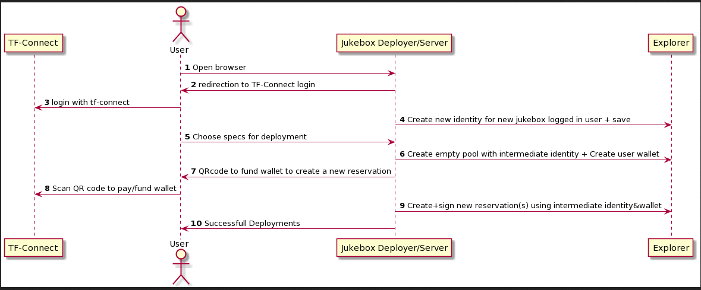

# System requirements

System that is easy to provision blockchain nodes (public, private)
- user can create X blockchain nodes on a random or specific locations
- user can list their blockchain nodes
- Should the user have ssh access to the node?
- check node status/info
- external authentication/payment system using threefold connect app
- user can delete their blockchain nodes
- user can access their blockchain nodes?

# Non-functional requirements

- How many expected concurrent users: 100
- How many users on the system: 10000-100000
- Expected Data volume: max would be 1000 solution per user, 1KB metadata max per solution around 1MB per user, max data size would be 100GB
- Data store: probably filesystem is better
- How critical is the system? it needs to be alive all the time, can afford a few mins being down.
- Life cycle of the nodes? How does the user keep their nodes alive? we regularly ask the user to topup their pools using *notifications* to extend the pools(background service)
- Grid workload to deploy the blockchain nodes: so far containers as it seems all of the blockchain nodes are working fine on ipv6
- Intermediate identity on deployer for each user : will be used to sign reservations
- Wallet for each user: will be payed to by user when asked during deployment, and will be used to pay for reservations
- Backup: it is required to backup the machine that is running the deployer to s3 
- In case the node went down for some reason should we just warn the user or  we need to redeploy?
    - in case of redeploying: first we add ourselves to the list for delete signers to be able to delete it and then the user will be asked to issue /redeploy from bot to bring back the deleted node

# Components mapping / SALs

- Entities: User, Blockchain Node
- ReservationBuilder: builds reservation and sign with the intermediate identity   
- UserInfo: user info are loaded from threefold login system
- Blockchain Node (role, configurations) 
- User notifications / topup
   - Notifications on deployer website
- Service view: web interface
- Monitoring: monitoring + redeployment of the solutions again if they go down using intermediate identity
- Logging 

# Tech stack

- JS-SDK
- tf_jukebox 

## ZOS

- there are some blockchain nodes that requires IPv4, if we decided to include them in the deployer, we have two options:
   - Containers to support IPv4
   - We start them in VMs

## Blockchains IPv4/IPv6 status

| Partner                  	| Node Type        	| IPv4      	| IPv6      	|
|--------------------------	|------------------	|-----------	|-----------	|
| **Dash**                     	| Full             	| Yes       	| Yes       	|
|                          	| Master           	| Yes       	| Yes       	|
| **Digibyte**                 	| Full             	| Yes       	| Yes       	|
|                          	|                  	|           	|           	|
| **Matic (Polygon)**          	| Sentry           	| Yes       	| No        	|
|                          	| Full             	| Yes       	| No        	|
|                          	| Validator        	| Yes       	| No        	|
| **Presearch**                	| Basic            	| Yes       	| No        	|

# Sequence Diagram using blockchain deployer website (Preferred Solution)
- Blockchain deployer where we can only deploy vms/containers directly on the grid without the need to have a VDC
- Users will only need to login with tf-connect to the portal and only have to pay to intermediate wallet by scanning QR code from the browser
- The advantage of this solution is the user experience will be consistent across our grid services(VDC deployer, 3bot deployers, Marketplace....). 

